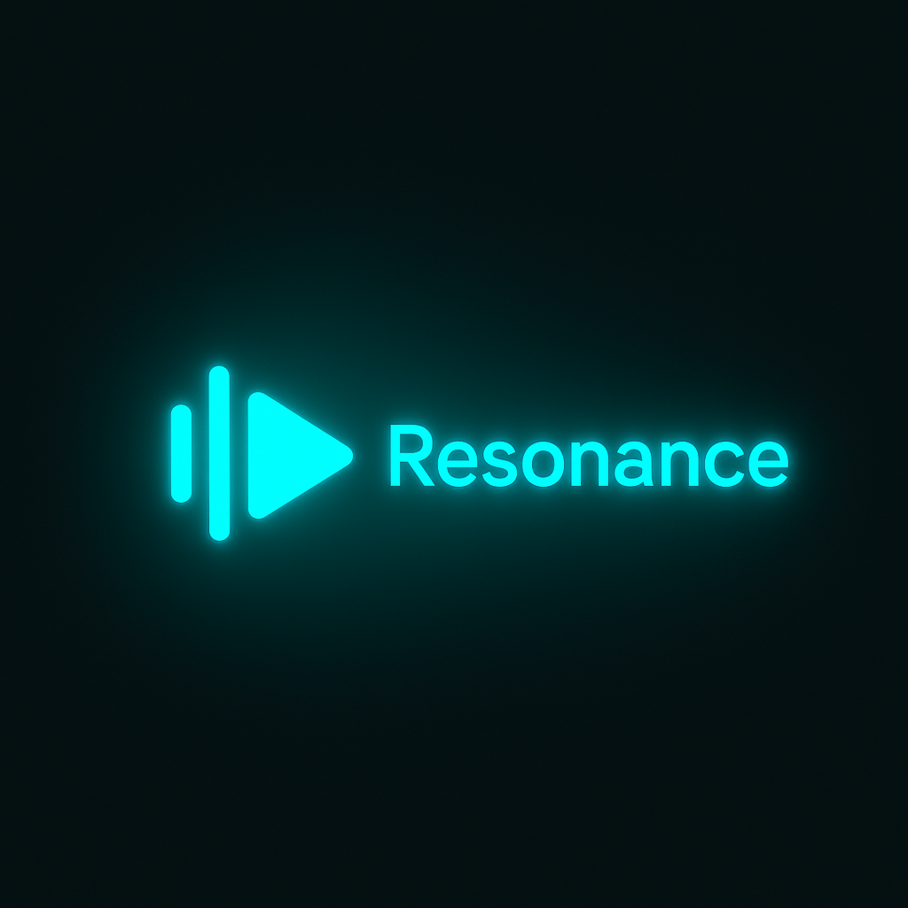

# Resonance

**AI-Powered YouTube Music Desktop App**

A beautiful desktop application for YouTube Music with Spotify-inspired design and AI-powered features.



## Features

### Current (v1.0)
- ✅ Beautiful splash screen with animations
- ✅ Clean, Spotify-inspired dark UI
- ✅ Native desktop app (Windows, macOS, Linux)
- ✅ Media key support (Play/Pause, Next, Previous)
- ✅ System tray integration
- ✅ Keyboard shortcuts
- ✅ Direct YouTube Music login (use your own account, no API costs!)
- ✅ **Music Visualizer** - Real-time background that pulses with your music!
  - 3 visualization modes (Pulse, Waves, Ambient)
  - 8 color presets + custom color picker
  - Adjustable intensity slider
  - Saves your preferences

### Coming Soon (UI Ready, AI Backend Pending)
- 🎯 Natural Language Search ("upbeat songs for Friday afternoon")
- 🎯 AI Playlist Generator
- 🎯 Smart Queue Management
- 🎯 AI DJ / Radio Host
- 🎯 Mood Detection
- 🎯 Lyrics & Song Insights

## Installation

### Prerequisites
- **Node.js 18+** - Required to run Resonance
  - **Windows users:** See [INSTALL_NODEJS_WINDOWS.md](./INSTALL_NODEJS_WINDOWS.md) - Simple step-by-step guide
  - **Mac/Linux users:** [Download from nodejs.org](https://nodejs.org/)
- YouTube Music Premium subscription (recommended)

### Quick Start

**First time setup?** Choose your guide:
- **Windows (No Node.js yet):** [INSTALL_NODEJS_WINDOWS.md](./INSTALL_NODEJS_WINDOWS.md) - Start here!
- **Windows (Have Node.js):** [WINDOWS_SETUP.md](./WINDOWS_SETUP.md) - Troubleshooting guide
- **macOS/Linux:** Make sure Node.js is installed, then follow steps below

1. **Install dependencies:**
   ```bash
   npm install
   ```

2. **Run the app:**
   ```bash
   npm start
   ```

3. **Development mode (with DevTools):**
   ```bash
   npm run dev
   ```

4. **Build for your platform:**
   ```bash
   # Windows
   npm run build:win

   # macOS
   npm run build:mac

   # Linux
   npm run build:linux
   ```

## Color Scheme

Resonance uses a beautiful cyan/teal color palette:

- **Primary:** `#00E5FF` - Bright cyan
- **Background:** `#0A1A1F` - Dark teal
- **Accent:** `#4DFFFF` - Light cyan
- **Text:** `#FFFFFF` - White

See `src/colors.css` for the complete color system.

## Keyboard Shortcuts

### Playback
- `Space` - Play/Pause
- `Cmd/Ctrl + →` - Next Track
- `Cmd/Ctrl + ←` - Previous Track

### AI Features
- `Cmd/Ctrl + K` - Open AI Search
- `Cmd/Ctrl + P` - Open AI Playlist Generator
- `Cmd/Ctrl + V` - Toggle Music Visualizer

### App
- `Cmd/Ctrl + Shift + I` - Toggle Developer Tools
- `Cmd/Ctrl + R` - Reload
- `Cmd/Ctrl + Q` - Quit

### Media Keys
- `Media Play/Pause` - Play/Pause
- `Media Next` - Next Track
- `Media Previous` - Previous Track

## Project Structure

```
resonance/
├── main.js              # Main Electron process
├── preload.js           # Secure bridge between main and renderer
├── package.json         # Dependencies and build config
├── RenosanceLogo.png    # App logo
├── src/
│   ├── splash.html      # Splash screen
│   ├── colors.css       # Color scheme and design tokens
│   └── (future AI features here)
└── README.md
```

## How It Works

Resonance is an Electron-based desktop wrapper for YouTube Music that:

1. **Loads YouTube Music directly** - You sign in with your own account
2. **No API costs** - Uses the web interface, not YouTube's API
3. **Adds desktop features** - Media keys, tray icon, shortcuts
4. **Future AI integration** - Will inject AI features into the interface

This means:
- ✅ Your playlists, likes, and history sync automatically
- ✅ No separate authentication needed
- ✅ Works with YouTube Music Premium features
- ✅ Zero YouTube API quota usage

## Development Roadmap

See [PRD.md](./PRD.md) for the complete Product Requirements Document.

### Phase 1: MVP ✅ (Complete!)
- Basic YouTube Music integration
- Spotify-style UI foundation
- Splash screen
- Media controls

### Phase 2: AI Features (Next)
- Natural Language Search
- AI Playlist Generator
- Smart Queue Management

### Phase 3: Premium Features
- AI DJ
- Voice Control
- Advanced analytics

## Why Resonance?

**Resonance** (noun):
1. The quality of being resonant
2. A vibration of large amplitude in a system
3. **Perfect sync between AI and your music taste** 🎵

## License

MIT

## Contributing

This is a personal project, but suggestions and bug reports are welcome!

---

**Made with ❤️ and AI**
